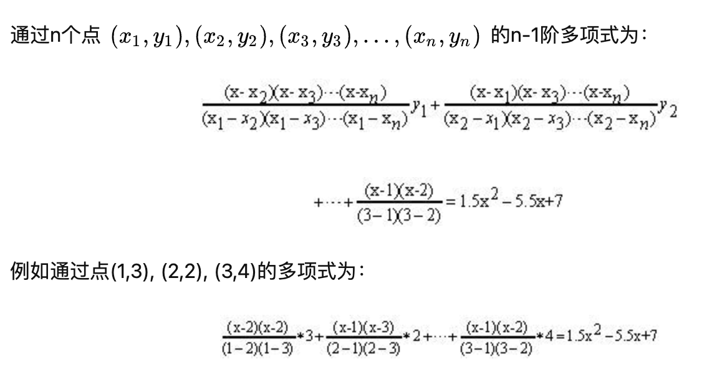

- 参考
    - https://medium.com/@VitalikButerin/quadratic-arithmetic-programs-from-zero-to-hero-f6d558cea649
    - https://blog.csdn.net/xiaozhupeiqi321/article/details/125064559?utm_medium=distribute.pc_aggpage_search_result.none-task-blog-2~aggregatepage~first_rank_ecpm_v1~rank_v31_ecpm-2-125064559-null-null.pc_agg_new_rank&utm_term=qap%E9%97%AE%E9%A2%98&spm=1000.2123.3001.4430
    - https://zhuanlan.zhihu.com/p/33307259
    - https://blog.csdn.net/guoyihaoguoyihao/article/details/103056359

## zkSNARKs工作原理

- 工作原理分为4步
    1. 将欲证明的计算性问题，转换成门电路 Circuit
    2. 将门电路 Circuit 转换成 R1CS
    3. 将 R1CS 转变成 QAP 
    4. 基于 QAP 实现 zkSNARK 的算法

- 为什么要转为复杂的QAP多项式？
    - 因为多项式的作用，可以理解为一个“杠杆”，或者叫“误差放大器”。
    - zkSNARK 提高 Verifier 效率的根本原理。

### 1. 将欲证明的计算性问题，转换成门电路 Circuit
- 对于方程，x**3 + x + 5 = 35，不透露答案但证明你知道这个立方方程的解。
    - 证明方已知解是3，解用来构造witness，然后再通过witness构造零知识证明。

1. 首先，我们将计算性问题 “拍平(Flattening)”，使之变成一个个门电路，我们可以将其拍平成 4 个门电路
    1. sym1 = x * x
    2. y = sym1 * x
    3. sym2 = y + x
    4. out = sym2 + 5
- sym1、sym2、y 是整个计算过程中用的临时变量，而 out 则代表计算过程的最终输出结果。
- 上面这4个表达式，称为4个约束条件。这四个约束条件，也可以被理解为4个门电路。

### 2. 将门电路转换成 R1CS 形式
- [什么是R1CS](### 什么是R1CS)

- 将4个门电路分别转为R1CS，需要用到的变量为 '~one', 'x', '~out', 'sym_1', 'y', 'sym_2'

- 'x', '~out', 'sym_1', 'y', 'sym_2' 为转换成门电路时引入的变量； ~one 代表数字1。

- 证明方已知witness。这几个临时变量就是解向量witness，因为我们知道 x=3，所以将它带入门电路声明的语句就可得到其他变量的解，因此witness为[1,3,9,27,30,35]。

- 将一个个门电路转为一个个R1CS
    ```
    ['~one', 'x', '~out', 'sym_1', 'y', 'sym_2']
    第一个门电路 sym1 = x * x 即  x * x - sym1 = 0 的R1CS为：
    a = [0, 1, 0, 0, 0, 0]
    b = [0, 1, 0, 0, 0, 0]
    c = [0, 0, 0, 1, 0, 0]

    第二个门电路 y = sym1 * x 即 sym1 * x - y = 0 的R1CS为：
    a = [0, 0, 0, 1, 0, 0]
    b = [0, 1, 0, 0, 0, 0]
    c = [0, 0, 0, 0, 1, 0]

    第三个门电路 sym2 = y + x 即 (y + x) * 1 - sym2 = 0 的R1CS为：
    a = [0, 1, 0, 0, 1, 0]
    b = [1, 0, 0, 0, 0, 0]
    c = [0, 0, 0, 0, 0, 1]

    第四个门电路 ~out = sym2 + 5 即 (sym_2 + 5) * 1 - ~out = 0 的R1CS为：
    a = [5, 0, 0, 0, 0, 1]
    b = [1, 0, 0, 0, 0, 0]
    c = [0, 0, 1, 0, 0, 0]
    ```

- 完整的R1CS为
    ```
    ['~one', 'x', '~out', 'sym_1', 'y', 'sym_2']
    A
    [0, 1, 0, 0, 0, 0]
    [0, 0, 0, 1, 0, 0]
    [0, 1, 0, 0, 1, 0]
    [5, 0, 0, 0, 0, 1]
    B
    [0, 1, 0, 0, 0, 0]
    [0, 1, 0, 0, 0, 0]
    [1, 0, 0, 0, 0, 0]
    [1, 0, 0, 0, 0, 0]
    C
    [0, 0, 0, 1, 0, 0]
    [0, 0, 0, 0, 1, 0]
    [0, 0, 0, 0, 0, 1]
    [0, 0, 1, 0, 0, 0]
    ```

### 3. 将 R1CS 转变成 QAP
- R1CS 是由向量组成的点积运算来描述问题， QAP 是使用多项式来描述问题。

- 使用拉格朗日差值公式来将 R1CS 转化为 QAP 形式。之后会将所有R1CS（四个长度为六的三向量组）转化为六组多项式。 

- 我们共有四个约束，因此我们使用 x = 1,2,3,4 。

- 先求出四个约束所对应的每个 a 向量的第一个值的多项式，也就是说使用拉格朗日插值定理求过点 (1,0), (2,0), (3,0), (4,5) 的多项式。
    - 将 (1,0), (2,0), (3,0), (4,5)，带入拉格朗日插值公式，为 
    ```python
        = ((x-1) * (x-2) * (x-3)) / ((4-1) * (4-2) * (4-3)) * 5
        = 5/6 * x**3 - 5 * x**2 + 55/6 * x - 5
        ~= 0.833 * x**3 - 5 * x**2 + 9.166 * x - 5
    ```
    - 然后将 (1,1), (2,0), (3,1), (4,5)，带入拉格朗日插值公式...以此类推

- 最后求得四个约束 的多项式为
    ```
    这些系数是升序排序的，例如 0.833 * x**3 - 5 * x**2 + 9.166 * x - 5 对应 [-5.0, 9.166, -5.0, 0.833]

    A polynomials
    [-5.0, 9.166, -5.0, 0.833]
    [8.0, -11.333, 5.0, -0.666]
    [0.0, 0.0, 0.0, 0.0]
    [-6.0, 9.5, -4.0, 0.5]
    [4.0, -7.0, 3.5, -0.5]
    [-1.0, 1.833, -1.0, 0.166]
    B polynomials
    [3.0, -5.166, 2.5, -0.333]
    [-2.0, 5.166, -2.5, 0.333]
    [0.0, 0.0, 0.0, 0.0]
    [0.0, 0.0, 0.0, 0.0]
    [0.0, 0.0, 0.0, 0.0]
    [0.0, 0.0, 0.0, 0.0]
    C polynomials
    [0.0, 0.0, 0.0, 0.0]
    [0.0, 0.0, 0.0, 0.0]
    [-1.0, 1.833, -1.0, 0.166]
    [4.0, -4.333, 1.5, -0.166]
    [-6.0, 9.5, -4.0, 0.5]
    [4.0, -7.0, 3.5, -0.5]
    ```

### 4. 检查 QAP
- 通过将 R1CS 转换成 QAP 我们可以通过多项式的内积运算来同时检查所有的约束，而不是像R1CS 那样单独的检查每一个约束。


## 概念
### 什么是R1CS
- R1CS（Rank-1 constraint system）(一阶约束系统).
- R1CS 是目前描述电路的一种语言。

1. R1CS 
    - 是由三个向量(a, b, c)组成的序列。
    - 向量 s 是 R1CS 的解。（解向量 s 就是 witness）。
    - s 需要满足方程 s · a * s · b - s · c = 0。

2. 例如以下例子就满足R1CS。
    ```
    a = (5,0,0,0,0,1)，
    b = (1,0,0,0,0,0)，
    c = (0,0,1,0,0,0)，
    s = (1,3,35,9,27,30)，
    ```

### 拉格朗日差值公式
- 拉格朗日差值公式的作用是构造一个穿过指定点的多项式。

- 