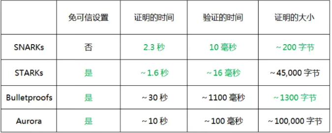

## ZKP概述
- ZKP定义
    - Zero-Knowledge Proof
    - “零知识证明”指的是证明者能够在不向验证者提供任何有用的信息的情况下，使验证者相信某个论断是正确的。
    - 一个证明者，叫做 Prover，可以为计算过程生成一个简短的证明字符串。Verifier 读取这个字符串，就可以判断给定的公开输入和输出是否合法。

- 零知识证明和区块链的关系?
    - 在区块链网络中，可以把每笔交易的转账双方地址、转账金额等信息隐藏起来，同时又能让矿工证明交易是合法的，这就是零知识证明在区块链中的应用。
 
## ZKP相关链接
- 文章
    - 零知识证明是什么 https://www.youtube.com/watch?v=FuKEpOhiVPg
    - zk-SNARKs讲解 https://mirror.xyz/0x3167e3c376FcC051D4460c1B923212B66dC6f450/sDmccxN7lzGz3fZ34Log1YpaBwloy0lY5wfr9qVH-Ww
    - zk-SNARKs讲解 https://medium.com/@ppio/zksnarks-zero-knowledge-proof-feb76bf49e1a （中文翻译https://www.daimajiaoliu.com/daima/4ed1d08d2900404）
    - zk-SNARKs视频讲解1 https://github.com/Whisker17/zkpThings/issues/13
    - zk-SNARKs视频讲解2 https://www.youtube.com/watch?v=55t-UANj7k4#/
    - V神对zk-SNARK的讲解 https://medium.com/@VitalikButerin/quadratic-arithmetic-programs-from-zero-to-hero-f6d558cea649
    - zCash对zk-SNARK的讲解 https://z.cash/technology/zksnarks/

- 网站
    - Zero-Knowledge专题网站 https://zeroknowledge.fm/about/

- 学习 
    - https://github.com/matter-labs/awesome-zero-knowledge-proofs
    - https://a16zcrypto.com/zero-knowledge-canon/#/

## ZKP发展历史
1. 起源
    1. 1985年
    2. 麻省理工学院的研究人员 Shafi Goldwasser, Silvio Micali, 和 Charles Rackoff 
    3. 发表了论文 Zero-Knowledge Proofs [GMR85]，提出了“零知识”的概念。 
    4. https://citeseerx.ist.psu.edu/viewdoc/download?doi=10.1.1.419.8132&rep=rep1&type=pdf

2. ZKP的可行性
    1. 1991年
    2. Oded Goldreich, Silvio Micali, 和 Avi Wigderson
    3. 发表了一篇论文[GMW91]，证明了任何一个NP问题都有对应的零知识证明算法。

3. 精简的证明 
    1. 1992
    2. Succinct ZK[K92]
    3. http://people.csail.mit.edu/vinodv/6892-Fall2013/efficientargs.pdf

4. Pinocchio
    1. 2013
    2. https://eprint.iacr.org/2013/279.pdf

5. zk-SNARKs协议Groth16算法
    - 2016年
    - Groth 提出了 Groth16算法，证明计算量被大幅度减少，从此，零知识证明开始逐步被真正的商用化落地。
    - https://eprint.iacr.org/2016/260.pdf

6. Bulletproofs协议
    - 2017年
    - https://web.stanford.edu/~buenz/pubs/bulletproofs.pdf

7. zk-STARKs协议
    - 2018年
    - https://eprint.iacr.org/2018/046

8. 通用的zk-SNARKs协议
    - 2019年
    - 通用的是指可信参数只需要生成一次，Sonic算法是第一个通用的zk-SNARKs算法。
    - https://eprint.iacr.org/2019/099

## ZKP协议
- 零知识证明目前有多种实现方式，每种方式在证明大小、证明者时间以及验证时间上都有自己的优缺点。

- 实现零知识证明协议的一种方式
    1. 单向函数： 将A加密为B，验证者不能从B反推回A。实现隐藏信息的功能。
    2. 同态映射： f(a+b) = f(a) + f(b) 。实现证明我知道被隐藏的信息的功能。通俗理解为在条件X下，一个形状A被映射为影子B，把形状切割为n份物体；证明者能将这n份物体组装，在条件X下，映射为影子C。验证者比较B是否等于C。
    3. 证明NPC问题的多项式（并非唯一的方法）： 可以实现通用零知识证明。
    - 不同的零知识证明协议在这三点上的具体实现是不一样的，最主要的不同可能体现在第 3 点中，哪怕证明的是同一个 NPC 问题，也可以有截然不同的方法。因为不同的设计，零知识证明协议最常被提及的差异主要包括：不同的计算空间和计算时间。更小的空间和更短的时间是不断改进零知识证明协议的主要动力，也是比较不同零知识证明协议的主要指标。

- zk-STARKs
    - zero-knowledge Scalable Transparent Argument of Knowledge
    - 理论理解：假设 P 有 9 个要证明的数，a1，a2，……，a9，那么把它们编码成 b1，b2，……，b9，每个bi中都含有a1，a2，……，a9 的部分信息。在做验证的时候，验证者对 b1，b2，……，b9 做抽样检查，从少量 bi 中就能分析出编码有没有错误，这样就可以大概率探测到 a1，a2，……，a9 是否属实。
    1. 没有使用单向函数，因为验证者并不能获取所有的b1,b2,b3...b9。
    2. 没有使用同态映射，它不是抽象代数（或密码学）中的同态概念，而是基于线性编码纠错理论进行抽样验证。
    3. 没有使用证明NPC问题的多项式，而是基于概率检查做验证的。
    
- zk-SNARKs
    - zero-knowledge Succint Non-interactive ARguments of Knowledge
    - Zero knowledge：零知识。证明者不泄漏欲证明的隐私信息。
    - succinct：简明的，证明的数据量比较小，方便验证。
    - Non-interactivity：非交互的，证明者只要提供一个字符串，可放在链上公开验证。
    - Arguments：证明过程是计算完好（computationally soundness）的，证明者无法在合理的时间内造出伪证（破解）。
    - of knowledge：对于一个证明者来说，在不知晓特定证明 (witness) 的前提下，构建一个有效的零知识证据是不可能的。
    - 目前实现zkSNARK电路的框架有libsnark（C++），bellman (Rust)，ZoKrates（DSL），Circom（js）等等。

- ZKP协议对比 

- ZKP的效率问题
    1. 交互轮数
    2. 证明时间
    3. 证明数据大小
    4. 验证时间
    5. 是否可以变为非交互式的：证明者只要提供一个字符串，可放在链上公开验证。

## zkSNARK协议算法
1. Groth16
    - Groth16 是目前最快、数据量最小的 zk-SNARKs，被用于 Zcash 等。Groth16 的 CRS （the Common Reference String）不是通用的，其设置需要绑定到一个特定的电路。由于其速度和证明的小数据量，因此常常被新的 zk-SNARKs拿来比较性能。
    - https://eprint.iacr.org/2016/260

2. Sonic
    - Sonic 是一种早期的通用 zk-SNARKs协议，支持通用、可升级的参考字符串，论文发表于 2019 年 1 月。Sonic 的证明大小固定，但是验证成本高，理论上可以将多个证明分批验证以获得更好的性能。许多新的 zk-SNARKs算法都是基于 Sonic。
    - https://eprint.iacr.org/2019/099

3. Fractal
    - Fractal 是一种允许递归的 zk-SNARKs。通过对电路的预处理实现了透明设置。证明最大 250KB，这比其他构建生成的证明都要大的多。
    - https://eprint.iacr.org/2019/099

4. Halo
    - Halo 支持递归证据组织，无需可信设置，与其他新的 zk-SNARKs构建不同，Halo 的验证时间是线性的。
    - https://eprint.iacr.org/2019/1021

5. SuperSonic
    - Sonic 的改进版，是第一个在验证时间和证明数据量方面实用化的透明 zk-SNARKs。
    - https://eprint.iacr.org/2019/1229

6. Marlin
    - Sonic 的改进版，证明时间缩短 10 倍，验证时间缩短 4 倍。universal trusted setup。
    - https://eprint.iacr.org/2019/1047
    - https://github.com/arkworks-rs/marlin 基于Rust语言的学术实现
    - 代表项目 Aleo

7. Plonk
    - Sonic 的改进版，证明时间缩短 5 倍。universal trusted setup。
    - https://eprint.iacr.org/2019/953
    - 代表项目 zkSync

## 新zkSNARK协议算法
1. Poseidon Hash 波塞冬
    - 论文 https://eprint.iacr.org/2019/458.pdf

2. Plookup
    - 不需要可信设置
    - Plonkup的发展
        1. Halo，采用的Sonic算法里提到的polynomial IOP方案，在此方案的基础上实现了recursive proof composition without a trusted setup。
        2. Halo2 https://zcash.github.io/halo2/design/proving-system/lookup.html
        3. Plonkup由Gabizon发表于2020年，利用lookup查找表提升减少计算，可以提升证明者效率。Plonkup可以实现递归证明而无需椭圆曲线对（如Halo等需要椭圆曲线对）

## 多项式承诺协议
1. bulletproof
2. KZG
3. FRI

## zk应用编程语言
- Circom
    - 是一种用于编写零知识证明的算术电路的语言，Circom简化了创建zk-snark电路的复杂度。Circom有个template关键字，template类似于java面向对象语言中的class，与class一样定义好的模板可以在不同的电路或其他的项目中重用。

## 其它
- FPGAs对zkp的加速 https://www.paradigm.xyz/2022/04/zk-hardware

- https://www.youtube.com/watch?v=55t-UANj7k4#/
- Proof Systems
    - zkSNARKs
        - R1CS
            1. Groh16
            2. Marlin